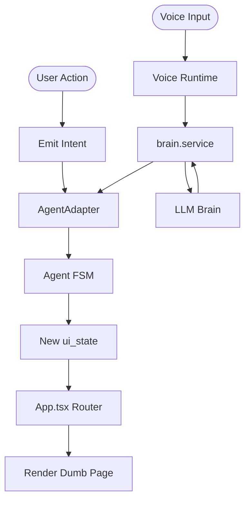

# Frontend Code Documentation

## 1. Folder Structure

```
KIOSK_FRONTEND_V1/frontend/
├── package.json                  # Project dependencies and scripts
├── tsconfig.json                 # TypeScript configuration
├── vite.config.ts                # Vite bundler configuration
├── index.html                    # HTML entry point
├── index.tsx                     # React entry point
│
├── app/
│   └── App.tsx                   # Main application component with routing
│
├── agent/                        # Agent/FSM authority (DO NOT MODIFY - Backend integration)
│   ├── index.ts                  # Agent state machine core
│   ├── adapter.ts                # Frontend-Agent adapter
│   ├── agent.test.ts             # Agent unit tests
│   ├── integration.test.ts       # Integration tests
│   └── test_loop.ts              # Test utilities
│
├── api/
│   └── index.ts                  # API client placeholder
│
├── state/                        # UI state management
│   ├── uiState.types.ts          # State type definitions
│   ├── uiState.machine.ts        # State machine logic (DEPRECATED - use agent/)
│   └── uiContext.ts              # React context for UI state
│
├── pages/                        # Page components (SAFE TO MODIFY)
│   ├── IdlePage.tsx              # Screensaver/attract mode
│   ├── WelcomePage.tsx           # Welcome screen (voice + manual modes)
│   ├── ScanIdPage.tsx            # ID scanning screen
│   ├── RoomSelectPage.tsx        # Room selection screen
│   ├── BookingCollectPage.tsx    # [NEW] Conversational booking form
│   ├── BookingSummaryPage.tsx    # [NEW] Booking confirmation for review
│   ├── PaymentPage.tsx           # Payment processing screen
│   └── CompletePage.tsx          # Completion/success screen
│
├── components/                   # Reusable UI components (SAFE TO MODIFY)
│   ├── BackButton.tsx            # Navigation back button
│   ├── CaptionsOverlay.tsx       # Voice transcript overlay
│   ├── DevToolbar.tsx            # Development toolbar
│   ├── ErrorBanner.tsx           # Error notification banner
│   ├── MicrophoneButton.tsx      # Voice input button
│   ├── ProgressBar.tsx           # Progress indicator
│   ├── RoomCard.tsx              # Room display card
│   ├── WebcamScanner.tsx         # Webcam/ID scanner component
│   └── ui/                       # UI primitives and effects
│       ├── animated-gradient-background.tsx
│       ├── beams-background.tsx
│       ├── button.tsx
│       ├── hover-reveal-cards.tsx
│       ├── orb.tsx
│       ├── particle-wave.tsx
│       └── voice-input.tsx
│
├── voice/                        # Voice/audio runtime (DO NOT MODIFY - Complex integration)
│   ├── VoiceRuntime.ts           # Main voice runtime controller
│   ├── audioCapture.ts           # Audio capture via AudioWorklet
│   ├── deepgramClient.ts         # Deepgram STT client
│   ├── TTSController.ts          # Text-to-speech controller
│   ├── TtsRuntime.ts             # TTS runtime manager
│   ├── SpeechOutputController.ts # Speech output handler
│   ├── normalizeTranscript.ts    # Transcript normalization
│   ├── voice.types.ts            # Voice type definitions
│   └── tts.types.ts              # TTS type definitions
│
├── services/                     # Service layer (DO NOT MODIFY - Backend integration)
│   ├── mockBackend.ts            # Mock backend for development
│   ├── voice.service.ts          # Voice service
│   ├── session.service.ts        # Session management service
│   ├── room.service.ts           # Room data service
│   ├── payment.service.ts        # Payment processing service
│   ├── brain.service.ts          # [NEW] Voice transcript to Agent intent bridge
│   └── tenantContext.ts          # [NEW] Tenant slug & headers management
│
├── mocks/                        # Mock data (SAFE TO MODIFY for testing)
│   ├── rooms.mock.json           # Room data JSON
│   ├── rooms.mock.ts             # Room data TypeScript
│   ├── session.mock.json         # Session data JSON
│   ├── session.mock.ts           # Session data TypeScript
│   ├── voice.mock.json           # Voice data JSON
│   └── voice.mock.ts             # Voice data TypeScript
│
├── hooks/                        # React hooks (SAFE TO MODIFY)
│   ├── useAnimation.ts           # Animation utilities
│   ├── useIdleTimeout.ts         # Idle timeout detection
│   └── useBrain.ts               # [NEW] Hook for conversational booking states
│
├── lib/                          # Utility libraries (SAFE TO MODIFY)
│   └── utils.ts                  # Utility functions (cn helper)
│
└── src/
    └── vite-env.d.ts             # Vite environment types

Total: 66 files across 13 directories
```

---

## 2. Configuration Files

### a) Location: `KIOSK_FRONTEND_V1/frontend/package.json`

```json
{
  "name": "kiosk-ui-frontend",
  "private": true,
  "version": "0.0.0",
  "type": "module",
  "scripts": {
    "dev": "vite",
    "build": "vite build",
    "preview": "vite preview"
  },
  "dependencies": {
    "@react-three/drei": "9.99.0",
    "@react-three/fiber": "8.15.16",
    "canvas-confetti": "^1.9.2",
    "class-variance-authority": "0.7.0",
    "clsx": "2.1.0",
    "framer-motion": "^11.18.2",
    "lucide-react": "0.300.0",
    "motion": "^12.33.0",
    "react": "18.2.0",
    "react-dom": "18.2.0",
    "react-webcam": "^7.2.0",
    "tailwind-merge": "2.2.1",
    "three": "0.160.0"
  },
  "devDependencies": {
    "@types/node": "^22.14.0",
    "@vitejs/plugin-react": "^5.0.0",
    "typescript": "~5.8.2",
    "vite": "^6.2.0"
  }
}
```

---

### b) Location: `KIOSK_FRONTEND_V1/frontend/tsconfig.json`

```json
{
  "compilerOptions": {
    "target": "ES2022",
    "experimentalDecorators": true,
    "useDefineForClassFields": false,
    "module": "ESNext",
    "lib": [
      "ES2022",
      "DOM",
      "DOM.Iterable"
    ],
    "skipLibCheck": true,
    "types": [
      "node"
    ],
    "moduleResolution": "bundler",
    "isolatedModules": true,
    "moduleDetection": "force",
    "allowJs": true,
    "jsx": "react-jsx",
    "paths": {
      "@/*": [
        "./*"
      ],
      "@contracts/*": [
        "../shared/contracts/*"
      ]
    },
    "allowImportingTsExtensions": true,
    "noEmit": true
  }
}
```

---

### c) Location: `KIOSK_FRONTEND_V1/frontend/vite.config.ts`

```typescript
import path from 'path';
import { defineConfig, loadEnv } from 'vite';
import react from '@vitejs/plugin-react';

export default defineConfig(({ mode }) => {
  const env = loadEnv(mode, '.', '');
  return {
    server: {
      port: 3000,
      host: '0.0.0.0',
    },
    plugins: [react()],
    define: {
      'process.env.API_KEY': JSON.stringify(env.GEMINI_API_KEY),
      'process.env.GEMINI_API_KEY': JSON.stringify(env.GEMINI_API_KEY)
    },
    resolve: {
      alias: {
        '@': path.resolve(__dirname, '.'),
        '@contracts': path.resolve(__dirname, '../shared/contracts'),
      }
    }
  };
});
```

---

### d) Location: `KIOSK_FRONTEND_V1/frontend/index.html`

```html
<!DOCTYPE html>
<html lang="en" class="dark">
  <head>
    <meta charset="UTF-8" />
    <meta name="viewport" content="width=device-width, initial-scale=1.0" />
    <title>Kiosk Interface</title>
    <script src="https://cdn.tailwindcss.com"></script>
    <link href="https://fonts.googleapis.com/css2?family=Inter:wght@300;400;500;600;700&family=Montserrat:wght@900&display=swap" rel="stylesheet">
    <style>
      body {
        font-family: 'Inter', sans-serif;
        background-color: #0f172a; /* Slate 900 */
        color: #f8fafc; /* Slate 50 */
        overflow: hidden; /* Kiosk mode usually implies no scrolling on main container */
      }
      /* Custom scrollbar for room list */
      ::-webkit-scrollbar {
        width: 8px;
      }
      ::-webkit-scrollbar-track {
        background: #1e293b; 
      }
      ::-webkit-scrollbar-thumb {
        background: #475569; 
        border-radius: 4px;
      }
      ::-webkit-scrollbar-thumb:hover {
        background: #64748b; 
      }
    </style>
  <script type="importmap">
{
  "imports": {
    "react": "https://esm.sh/react@18.2.0",
    "react/": "https://esm.sh/react@18.2.0/",
    "react-dom": "https://esm.sh/react-dom@18.2.0",
    "react-dom/": "https://esm.sh/react-dom@18.2.0/",
    "lucide-react": "https://esm.sh/lucide-react@0.300.0?deps=react@18.2.0",
    "canvas-confetti": "https://esm.sh/canvas-confetti@^1.9.2",
    "three": "https://esm.sh/three@0.160.0",
    "@react-three/fiber": "https://esm.sh/@react-three/fiber@8.15.16?external=react,react-dom,three",
    "@react-three/drei": "https://esm.sh/@react-three/drei@9.99.0?external=react,react-dom,three,@react-three/fiber",
    "class-variance-authority": "https://esm.sh/class-variance-authority@0.7.0",
    "clsx": "https://esm.sh/clsx@2.1.0",
    "tailwind-merge": "https://esm.sh/tailwind-merge@2.2.1",
    "framer-motion": "https://esm.sh/framer-motion@11.0.3?deps=react@18.2.0,react-dom@18.2.0"
  }
}
</script>
<link rel="stylesheet" href="/index.css">
</head>
  <body>
    <div id="root"></div>
  <script type="module" src="/index.tsx"></script>
</body>
</html>
```

---

### e) Location: `KIOSK_FRONTEND_V1/frontend/index.tsx`

```typescript
import React from 'react';
import ReactDOM from 'react-dom/client';
import App from './app/App';

const rootElement = document.getElementById('root');
if (!rootElement) {
  throw new Error("Could not find root element to mount to");
}

const root = ReactDOM.createRoot(rootElement);
root.render(
  <React.StrictMode>
    <BrowserRouter>
      <App />
    </BrowserRouter>
  </React.StrictMode>
);
```

---

## 3. Core Application

### a) Location: `KIOSK_FRONTEND_V1/frontend/app/App.tsx`

```typescript
import React, { useState, useEffect } from 'react';
import { Navigate, Route, Routes, useLocation, useNavigate, useParams } from 'react-router-dom';
import { UIContext } from '../state/uiContext';
// Agent Authority
import { AgentAdapter } from '../agent/adapter';
import { UiState } from '../agent/index';

// Pages
import { IdlePage } from '../pages/IdlePage';
import { WelcomePage } from '../pages/WelcomePage';
import { ScanIdPage } from '../pages/ScanIdPage';
import { RoomSelectPage } from '../pages/RoomSelectPage';
import { BookingCollectPage } from '../pages/BookingCollectPage';
import { BookingSummaryPage } from '../pages/BookingSummaryPage';
import { PaymentPage } from '../pages/PaymentPage';
import { CompletePage } from '../pages/CompletePage';

// UI Components
import { BackButton } from '../components/BackButton';
import { CaptionsOverlay } from '../components/CaptionsOverlay';
import { DevToolbar } from '../components/DevToolbar';
import { setTenantContext, TenantPayload } from '../services/tenantContext';

const DEFAULT_TENANT_SLUG = 'grand-hotel';

const STATE_TO_ROUTE: Record<UiState, string> = {
  IDLE: 'idle', WELCOME: 'welcome', AI_CHAT: 'ai-chat', MANUAL_MENU: 'manual-menu',
  SCAN_ID: 'scan-id', ROOM_SELECT: 'room-select', BOOKING_COLLECT: 'booking-collect',
  BOOKING_SUMMARY: 'booking-summary', PAYMENT: 'payment', KEY_DISPENSING: 'key-dispensing',
  COMPLETE: 'complete', ERROR: 'error',
};

const TenantKioskApp: React.FC = () => {
  const { tenantSlug } = useParams<{ tenantSlug: string }>();
  const location = useLocation();
  const navigate = useNavigate();

  // Local UI State (Renderer only)
  const [state, setState] = useState<UiState>('IDLE');
  const [data, setData] = useState<any>({});
  const [loading, setLoading] = useState(false);
  const [error, setError] = useState<string | null>(null);

  // 1. CONNECT TO AGENT BRAIN
  useEffect(() => {
    // Set tenant context for services that need it
    if (tenantSlug) {
      setTenantContext({ slug: tenantSlug } as TenantPayload);
    }

    // Subscribe to the Agent Adapter
    const unsubscribe = AgentAdapter.subscribe((newState, newData) => {
      console.log(`[APP RENDERER] Received State Update from Agent: ${newState}`);
      setState(newState);
      setData(newData || {});
      setLoading(false);
    });

    return unsubscribe;
  }, [tenantSlug]);

  // 2. EMIT INTENT (UI -> Agent)
  const emit = (type: string, payload?: any) => {
    console.log(`[UI EVENT] Emitting Intent: ${type}`, payload);
    setLoading(true);

    try {
      // Send to Authority
      AgentAdapter.handleIntent(type as any, payload);
    } catch (e) {
      console.error("Agent Error", e);
      setError("System Error");
      setLoading(false);
    }
  };

  // 3. DUMB ROUTER (State -> Component)
  // CRITICAL: This is a pure switch on Agent State. No logic allowed.
  useEffect(() => {
    // Sync URL with Agent State
    const route = STATE_TO_ROUTE[state];
    if (route && !location.pathname.endsWith(route)) {
        navigate(`/${tenantSlug || DEFAULT_TENANT_SLUG}/${route}`, { replace: true });
    }
  }, [state, tenantSlug, navigate, location]);

  const renderPage = () => {
    switch (state) {
      case 'IDLE': return <IdlePage />;
      case 'WELCOME': return <WelcomePage />;
      case 'AI_CHAT': return <WelcomePage />;
      case 'MANUAL_MENU': return <WelcomePage />;

      case 'SCAN_ID': return <ScanIdPage />;
      case 'ROOM_SELECT': return <RoomSelectPage />;
      case 'BOOKING_COLLECT': return <BookingCollectPage />;
      case 'BOOKING_SUMMARY': return <BookingSummaryPage />;
      case 'PAYMENT': return <PaymentPage />;

      case 'KEY_DISPENSING': return (
        <div className="h-screen w-full flex flex-col items-center justify-center bg-slate-900 text-white">
          <div className="animate-spin rounded-full h-16 w-16 border-t-2 border-b-2 border-blue-500 mb-4"></div>
          <h2 className="text-2xl font-light">Dispensing Key Card...</h2>
        </div>
      );

      // Complete Page
      case 'COMPLETE': return <CompletePage />;

      // Error State (Runtime)
      case 'ERROR': return (
        <div className="h-screen w-full flex flex-col items-center justify-center bg-red-900/20 text-white" onClick={() => emit('TOUCH_SELECTED')}>
          <h2 className="text-3xl font-bold mb-4">System Error</h2>
          <p>Please touch to restart.</p>
        </div>
      );

      default: return <IdlePage />;
    }
  };

  return (
    <UIContext.Provider value={{ state, data, emit, loading, transcript: '' }}>
      <div className="antialiased w-full h-full relative">

        {/* Global Navigation Controls (Visibility controlled implicitly by page rendering, backing is Agent driven) */}
        {/* <BackButton /> -- Removed global back button until Phase 7C data contract is ready. */}
        {/* <BackButton /> */}

        {error && (
          <ErrorBanner
            message={error}
            onDismiss={() => setError(null)}
          />
        )}

        <CaptionsOverlay />

        {renderPage()}

        {/* Debug Info (To prove state comes from Agent) */}
        <div className="fixed bottom-2 right-2 z-50 bg-black/50 text-white text-xs p-1 rounded opacity-30 hover:opacity-100 pointer-events-none">
          Authority: AgentAdapter | State: {state}
        </div>

        {/* Development Toolbar */}
        <DevToolbar />
      </div>
    </UIContext.Provider>
  );
};

export default App;
```

---

## 4. State Management

### a) Location: `KIOSK_FRONTEND_V1/frontend/state/uiState.types.ts`

```typescript
// contracts/backend.contract.ts is DEPRECATED in favor of Agent Authority
// Re-exporting the Single Source of Truth from the Agent
import { UiState } from '../agent/index';

export type { UiState as UIState };

export interface UIContextType {
  state: UiState;
  data: any; // Flexible metadata container
  transcript: string;
  emit: (type: string, payload?: any) => void;
  loading: boolean;
}
```

---

### b) Location: `KIOSK_FRONTEND_V1/frontend/state/uiContext.ts`

```typescript
import React, { createContext, useContext } from 'react';
import { UIContextType } from './uiState.types';

// Initial default context
const initialContext: UIContextType = {
  state: 'IDLE',
  data: {},
  transcript: '',
  emit: () => { throw new Error("Not Implemented: UIContext Provider missing"); },
  loading: false,
};

export const UIContext = createContext<UIContextType>(initialContext);

export const useUIState = () => useContext(UIContext);
```

---

### c) Location: `KIOSK_FRONTEND_V1/frontend/state/uiState.machine.ts`

> **Note**: This file is **DEPRECATED**. The Agent (`agent/index.ts`) is now the single source of truth for state transitions and intent logic.

```typescript
// Refer to agent/index.ts for the current state transition table.
```

---

## 5. Utilities

### a) Location: `KIOSK_FRONTEND_V1/frontend/lib/utils.ts`

```typescript
import { type ClassValue, clsx } from "clsx"
import { twMerge } from "tailwind-merge"

export function cn(...inputs: ClassValue[]) {
  return twMerge(clsx(inputs))
}
```

---

### b) Location: `KIOSK_FRONTEND_V1/frontend/api/index.ts`

```typescript
// Placeholder for Antigravity API adapter
export const ApiClient = {
  get: (url: string) => { throw new Error("Not Implemented: ApiClient.get"); },
  post: (url: string, body: any) => { throw new Error("Not Implemented: ApiClient.post"); }
};
```

---

## 6. Architecture Overview

### Frontend Architecture Principles

**CRITICAL RULES** (from `rules-for-antigravity.md`):

1. **Frontend Is a Renderer, Not a Brain**
   - Improve layout, visuals, animations, accessibility, responsiveness
   - NEVER decide flow, infer intent, auto-navigate, or simulate backend intelligence

2. **Never Change Flow Logic**
   - All screen changes happen ONLY when `ui_state` changes
   - No timers, no chaining, no assumptions

3. **`ui_state` Is Read-Only**
   - Read and render based on it
   - NEVER mutate, derive, or replace it

4. **Emit Intents, Never Outcomes**
   - Frontend emits: `CHECK_IN_SELECTED`, `VOICE_INPUT_STARTED`, `BACK_REQUESTED`
   - Frontend NEVER emits: `ID_VERIFIED`, `PAYMENT_SUCCESS`, `ROOM_ASSIGNED`

5. **Pages Must Be Dumb**
   - Pages don't know what comes next
   - Pages don't know where they came from
   - Pages only render UI and forward user actions

### Directory Ownership

**SAFE TO MODIFY** (Frontend-owned):
- `/pages` - Page components
- `/components` - UI components
- `/mocks` - Mock data for testing
- `/hooks` - React hooks
- `/lib` - Utilities

**DO NOT MODIFY** (Backend integration):
- `/agent` - Agent FSM authority
- `/services` - Service layer
- `/voice` - Voice runtime (complex integration)
- `/api` - API contracts

### Data Flow



---

## 6. Communication Protocols (Intents)

Intents are the only way the frontend can request a state change. Current major intents in `agent/index.ts`:

| Category | Intents |
|----------|---------|
| **Navigation** | `BACK_REQUESTED`, `CANCEL_REQUESTED`, `RESET` |
| **Core Flow** | `PROXIMITY_DETECTED`, `TOUCH_SELECTED`, `VOICE_STARTED` |
| **Booking** | `BOOK_ROOM_SELECTED`, `ROOM_SELECTED`, `CONFIRM_BOOKING`, `CANCEL_BOOKING`, `MODIFY_BOOKING` |
| **Data Collection** | `PROVIDE_GUESTS`, `PROVIDE_DATES`, `PROVIDE_NAME` |
| **Payment** | `CONFIRM_PAYMENT` |

---

## 7. Voice & AI Integration

### a) Location: `KIOSK_FRONTEND_V1/frontend/hooks/useBrain.ts`

This hook provides components with reactive access to the "Brain" (LLM) state, including conversation history, accumulated booking slots, and processing status.

```typescript
export function useBrain() {
    return { conversationHistory, bookingSlots, isProcessing, sendTranscript, resetBrainSession };
}
```

### b) Location: `KIOSK_FRONTEND_V1/frontend/services/brain.service.ts`

The bridge between raw voice transcripts and the backend AI. It handles endpoint selection (chat vs. booking) and dispatches intents to the `AgentAdapter` based on confidence scores.

```typescript
export async function sendToBrain(transcript: string, currentState: string) {
    // 1. Fetch from backend /chat or /chat/booking
    // 2. Dispatch high-confidence intents to AgentAdapter
}
```

## 8. Key Components

1. **App.tsx** - Main application router
   - Subscribes to AgentAdapter for state updates
   - Provides `emit()` function to pages
   - Routes `ui_state` to appropriate page component

2. **AgentAdapter** - Bridge between UI and Agent
   - Receives intents from UI
   - Dispatches to Agent FSM
   - Publishes state updates to subscribers

3. **Pages** - Dumb renderers
   - Receive `ui_state` via context
   - Emit intents via `emit()` function
   - No business logic, no flow control

4. **VoiceRuntime** - Voice interaction system
   - Manages audio capture and STT
## 9. File Count Summary

| Directory | Files | Purpose |
|-----------|-------|---------|
| app/ | 1 | App root & routing |
| agent/ | 5 | State machine authority (DO NOT MODIFY) |
| api/ | 1 | API client placeholder |
| state/ | 3 | UI state management |
| pages/ | 8 | Page components (SAFE TO MODIFY) |
| components/ | 15 | Reusable UI components (SAFE TO MODIFY) |
| voice/ | 10 | Voice/audio runtime (DO NOT MODIFY) |
| services/ | 7 | Service layer (DO NOT MODIFY) |
| mocks/ | 6 | Mock data (SAFE TO MODIFY) |
| hooks/ | 4 | React hooks (SAFE TO MODIFY) |
| lib/ | 1 | Utilities (SAFE TO MODIFY) |
| **Total** | **66** | **Complete frontend codebase** |

---

## 10. Running the Frontend

### Development Mode
```bash
cd frontend
npm install
npm run dev
```

The frontend will run on `http://localhost:3000`

### Build for Production
```bash
npm run build
```

### Preview Production Build
```bash
npm run preview
```

---

## 11. Important Notes

### Merge-Safety Rule

> **"Can backend be plugged in later WITHOUT touching this file?"**

If the answer is NO → reject the change.

### Testing Without Backend

Delete backend logic entirely. Expected result:
- ✅ UI renders
- ✅ Buttons work
- ✅ Chat shows
- ❌ **Flow does NOT complete**

If flow still completes → frontend crossed the line.

### Golden Rule

> **Frontend makes things beautiful. Backend makes things correct.**

**Never help the backend by being clever.**

---

**End of Frontend Documentation**

---

## 12. Additional Resources

For detailed code of individual files, please refer to:
- **Pages**: See `/pages` directory for all 8 page components
- **Components**: See `/components` directory for all 15 UI components
- **Voice System**: See `/voice` directory for all 10 voice-related files
- **Agent System**: See `/agent` directory for FSM implementation
- **Services**: See `/services` directory for all 7 service files
- **Mocks**: See `/mocks` directory for all 6 mock data files

Each file is well-documented with inline comments explaining its purpose and usage.
